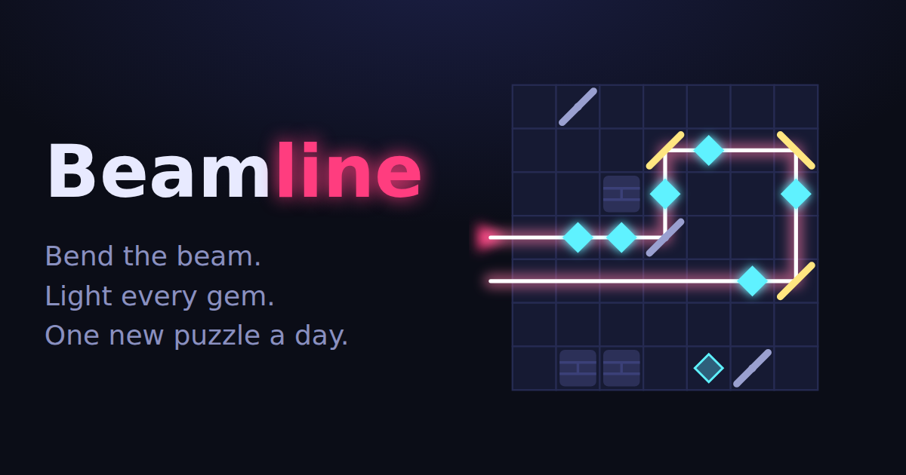

# Beamline

**Bend the beam. Light every gem. One new puzzle a day.**



Beamline is a daily puzzle game in the Wordle mould. A laser enters the board from the edge, and you have a
limited number of mirrors to bounce it through every gem. Monday's puzzle is gentle (6×6, two mirrors).
Sunday's is a *Supernova* (8×8, five mirrors to place, decoy mirrors and walls everywhere).

- **Infinite, free content.** Puzzles are generated deterministically from the date, so everyone gets the same
  board and nobody has to design them by hand. The generator lays down a real route first, then hides it,
  so every puzzle is solvable by construction. Tests check two years of dailies.
- **Real puzzles.** A brute-force solver run on generated boards found that most have just 1–3 solutions, so you can't
  stumble into them by luck.
- **Scoring that rewards thinking.** Par is your mirror budget, and every *new* placement counts (flipping and
  removing are free). Three stars for par, and "under par" if you find a shortcut.
- **Built-in viral loop.** A spoiler-free emoji share card, streaks, stats, an archive and unlimited practice.
- **Zero-cost stack.** Static HTML/JS/CSS with no build step and no backend, hosted on GitHub Pages.

## Play / develop

```bash
npm test          # engine tests (node --test)
npm start         # serves src/ locally
```

Files of note:

| File | What it is |
| --- | --- |
| `src/engine.js` | Pure puzzle logic: seeded RNG, generator, beam tracer, daily schedule. Shared by browser and tests. |
| `src/app.js` | UI: SVG board, input, timer, persistence, stats, sharing, archive/practice. |
| `src/config.js` | Site URL, tip-jar link, AdSense IDs. Leave a field empty to disable that feature. |
| `test/engine.test.js` | Determinism, solvability, difficulty schedule. |

URL modes: `/` (today), `/?d=2026-10-05` (archive), `/?p=<seed>&l=<1-7>` (practice; `p=random` rolls a new one).

## Deploy

`.github/workflows/pages.yml` runs the tests and publishes `src/` to GitHub Pages on every push to `main`.
One-time setup: **Settings → Pages → Source: GitHub Actions**. If you use a custom domain, update `siteUrl` in
`src/config.js` and the `og:image` URL in `src/index.html`.

## Revenue plan

The goal is a free daily habit with low-friction monetisation layered on top, in order of effort:

1. **Tip jar (live as soon as configured).** Set `supportUrl` (Ko-fi, Buy Me a Coffee or GitHub Sponsors). The link
   shows on the results screen, when players are happiest.
2. **One ad, results screen only (live as soon as configured).** Set `adsenseClient` and `adsenseSlot`. The board stays
   ad-free while people play. The script only loads after a solve.
3. **Beamline+ (next step, not built).** A one-time purchase or small subscription through Gumroad or Lemon Squeezy
   license keys. It would unlock new mechanics in practice mode (splitters, coloured beams, portals), hint tokens, and
   no ads. The generator is already parameterised (`LEVELS` in `engine.js`), so new mechanics extend the existing
   pipeline.
4. **Distribution.** Puzzle portals and newspapers license daily games. A deterministic, backend-free generator
   is easy to embed or white-label.

What matters first is retention, not monetisation. Watch D1/D7 return rates (add a privacy-friendly analytics
script such as Plausible or GoatCounter) before you spend effort on (3).

## License

MIT
