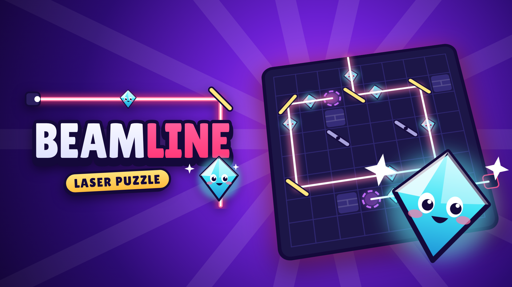

# Beamline

**Bend the beam. Light every gem.** A laser-and-mirror puzzle game built for HTML5 game portals
(CrazyGames, Poki) that can also run as its own website.



A laser enters the board from the edge. You have a limited number of mirrors to bounce it through every gem, and
the sleepy gems wake up and smile as the beam hits them.
Tap to place a mirror, tap again to flip it, tap a third time to remove it.

- **120 levels in 6 worlds**, each with its own colour theme, and three of them bring a new piece with a "NEW!" intro card:

  | World | Levels | New |
  | --- | --- | --- |
  | Spark | 1–20 | mirrors, walls, fixed mirrors (tutorial with an animated finger on levels 1–2) |
  | Glint | 21–40 | **mines**: the beam must not touch them |
  | Prism | 41–60 | **splitters**: glass that reflects *and* lets the beam through, so two beams |
  | Nova | 61–80 | **portals**: the beam goes in one and comes out the other |
  | Pulsar, Quasar | 81–120 | everything combined |

  A brute-force solver shows that most levels from Glint onwards have **exactly one solution**. They are real puzzles,
  not trial and error.
- **Stars:** ★★★ if you place no more mirrors than par. Using a hint caps the level at ★★.
- **Daily challenge:** one shared puzzle a day, with a streak counter. It gives players a reason to come back.
- **Generated levels.** Every level is built from a hidden solution route, so each one is guaranteed to be
  solvable. Tests check all 120 campaign levels and two years of dailies.
- **About 77 KB in total**, fonts included. No image or audio files: the graphics are SVG, and the sound effects and
  background music are synthesised with WebAudio. Music and sound can be muted separately.
- **Straight into gameplay.** The game skips the main menu and starts at the player's next level. Portals measure
  conversion from page load to play. The menu is one tap away.

## Portal integration

All SDK calls go through `src/platform.js`, so the game code never touches a portal directly.

| Moment | CrazyGames v3 | Poki v2 |
| --- | --- | --- |
| Boot | `SDK.init()`, `game.loadingStart/Stop()` | `PokiSDK.init()`, `gameLoadingFinished()` |
| Level starts / player returns from a menu | `game.gameplayStart()` | `gameplayStart()` |
| Level solved, menus, hint dialog | `game.gameplayStop()` | `gameplayStop()` |
| 3-star solve | `game.happytime()` | — |
| "Next level" / "Replay" | `ad.requestAd('midgame')` | `commercialBreak()` |
| Hint or **skip level** with no free hints left | `ad.requestAd('rewarded')`, after a "Stuck?" dialog | `rewardedBreak()` |
| Save | `data.setItem/getItem` (cloud save) | `localStorage` |

Other portal requirements this build meets:
- Audio is muted while an ad plays, and the UI is blocked with a spinner until the ad finishes or fails.
- Rewarded ads only start from an explicit "Watch video" confirmation, never from a button on the active board.
- A reward is granted only when the ad finishes. If the ad fails, the player sees a message and gets nothing.
- No external links, no own ads, and no sharing to outside URLs.
- It fits any iframe size without scrolling: side panel in landscape, stacked in portrait. Arrow keys and space
  never scroll the host page.
- Mute toggle. Keyboard play: arrows + space, Z undo, R restart, H hint, Esc back.
- If the SDK is missing or blocked by an ad blocker, the game still works fully.

Free hints: you start with 3 and earn 1 more for every 5 new levels cleared. After that, hints come from rewarded
ads, and so does skipping a level (players who get stuck can move on instead of quitting). Those are the main
revenue levers besides midgame ads.

## Build & submit

```bash
npm test                 # engine tests: all campaign levels + 2 years of dailies are solvable
npm run build            # dist/{web,crazygames,poki}/ + dist/beamline-<target>.zip
npm run build -- poki    # just one target
```

- **CrazyGames:** upload `dist/beamline-crazygames.zip` in the developer portal (it starts with a Basic Launch).
  Cover images are in `promo/` (1920×1080, 800×1200, 800×800), each with and without text (`-notext`; Poki
  wants thumbnails without text). Regenerate them with `NODE_PATH=$(npm root -g) node scripts/covers.js`
  while a server runs on `:8766` serving `dist/`. The logo and icon (`src/logo.svg`, `src/icon.svg`) come from
  `node scripts/logo.js`.
  The portal also wants a short gameplay video. Record one by hand from the CrazyGames build.
- **Poki:** apply via their developer site. Poki works invite/pitch-first; when accepted, upload
  `dist/beamline-poki.zip` through Poki for Developers.
- **Web:** `.github/workflows/pages.yml` runs the tests, builds `web` and deploys to GitHub Pages on every push to `main`.
  Setup: Settings → Pages → Source: GitHub Actions. The web build has no ads, and hints are free there.

Test inside the CrazyGames QA tool before submitting. Locally the SDK runs in demo mode.

## Code map

| File | Purpose |
| --- | --- |
| `src/engine.js` | Pure logic: seeded RNG, generator, beam tracer, campaign curve, daily schedule. Shared with the tests. |
| `src/app.js` | Screens, board rendering (SVG), input, hints, stars, progress, tips. |
| `src/platform.js` | Portal SDK adapter (CrazyGames / Poki / web). |
| `src/audio.js` | WebAudio sound effects. |
| `scripts/build.js` | Per-portal builds and zips. |
| `scripts/logo.js` | Generates the logo and icon (Lilita One embedded) and the gem character. |
| `scripts/covers.js` | Renders the portal cover images from the real game. |
| `src/fonts/` | Lilita One + Fredoka (SIL OFL), bundled so the game makes no external requests. |
